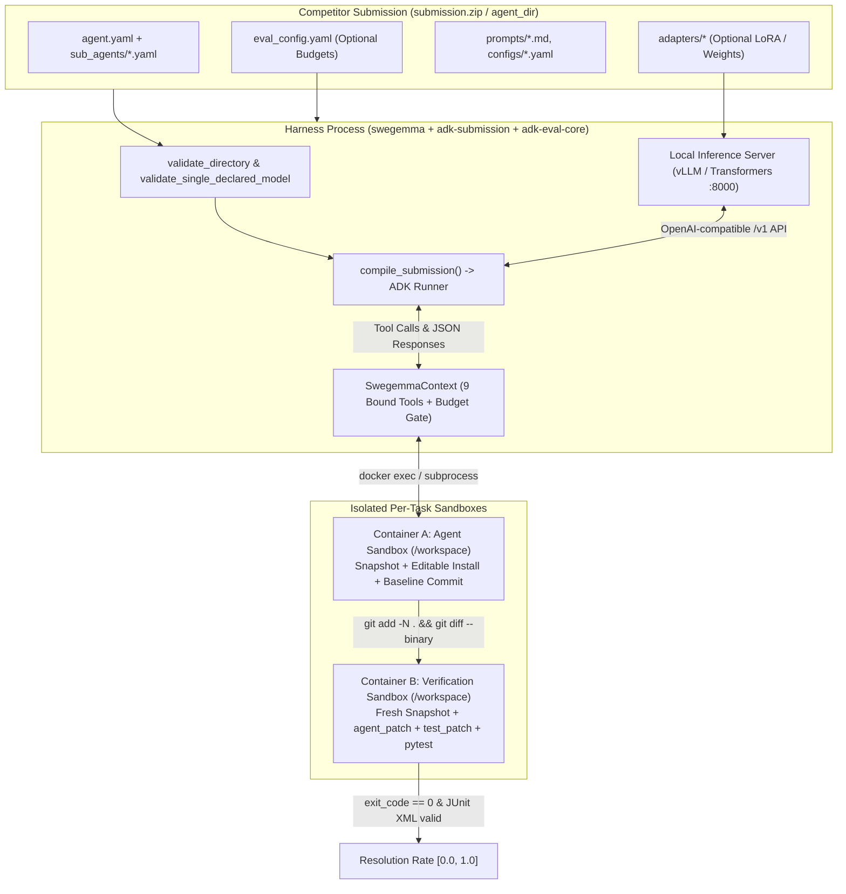

<p align="center">
  
</p>

<h1 align="center">Kaggle Gemma Developer Agent</h1>

<p align="center">
  <strong>🛠️ Work in progress · Local evaluation and remote model inference</strong>
</p>

<p align="center">
  A Gemma-powered coding agent that explores repositories, drafts bug fixes, and validates patches in Docker using the competition evaluation harness.
</p>

<p align="center">
  <a href="https://www.kaggle.com/competitions/gemma-4-developer-agent">Competition</a> ·
  <a href="#how-to-run">How to run</a> ·
  <a href="https://rishaviitd.github.io/kaggle.gemma.coding.agent/?v=paper-card-design">Presentation</a>
</p>

<p align="center">
  
  
  
  
  
  
  
</p>

## Overview

The [Gemma 4 Developer Agent Competition](https://www.kaggle.com/competitions/gemma-4-developer-agent) aims to bring autonomous coding assistance to consumer hardware. Participants post-train Gemma 4 to understand unfamiliar repositories, diagnose software issues, and generate correct patches using fine-tuning, reinforcement learning, prompts, and tools. Code graphs and embeddings support repository navigation; scoring measures the percentage of issues resolved through validation tests.

All agents must use `gemma-4-31b-it-qat-w4a16-ct`. Submissions include an `agent.yaml` configuration, supporting prompts, tools, skills, and optional LoRA adapters in `submission.zip`.

## Data

The competition provides a public training/development set for agent training, prompt design, and local validation. During scoring, it is replaced by a hidden test set. Both sets use the same graph-generation methods and verification standards. See the [dataset description](context/data.md) for the full schema.

### Training data

The public set contains **129 Python bug-fixing and feature-request tasks** from `fastapi/fastapi`, `Textualize/rich`, `psf/requests`, and `encode/httpx`.

| Asset         | What it contains                                                                                                                                              |
| ------------- | ------------------------------------------------------------------------------------------------------------------------------------------------------------- |
| `tasks.jsonl` | Task ID, repository, base commit, problem statement, optional hints, creation timestamp, reference solution (`patch`), and verification tests (`test_patch`). |
| `snapshots/`  | A Git repository archive for each task, frozen before the fix. Forward commit history is removed to prevent access to future solutions.                       |
| `graphs/`     | Python AST call and dependency graphs containing code symbols, source definitions, and relationships for structural navigation.                               |
| `embeddings/` | 256-dimensional float32 vectors for code symbols, used for semantic code search.                                                                              |

Reference fixes and verification tests are available for training and offline analysis. They must remain separate from the task input when measuring the agent's ability to solve an issue.

### Test data

The hidden test set has **about 120 tasks from private repositories**, split between public and private leaderboard evaluations. Reference fixes and grading tests are withheld.

## Harness

The competition harness compiles the YAML submission, provides repository tools to the agent, and verifies its patch in a fresh sandbox. The diagram below is reproduced from the [competition harness guide](context/harness.md).



### Supported tools

| Tool                       | Purpose                                                   |
| -------------------------- | --------------------------------------------------------- |
| `run_command`              | Run shell commands in the task workspace.                 |
| `read_file`                | Read workspace files.                                     |
| `edit_file` / `write_file` | Modify or create workspace files.                         |
| `get_status`               | Check remaining budget and patch status.                  |
| `submit_patch`             | Submit the generated Git diff.                            |
| `get_code_neighbors`       | Find related symbols and callers.                         |
| `search_similar_code`      | Find semantically similar code.                           |
| `get_code_subgraph`        | Inspect relationships among code symbols.                 |
| `load_skill_resource`      | Read a knowledge file from a skill attached to the agent. |
| `run_skill_script`         | Run an attached skill's script inside the task sandbox.   |

Skill tools are available when skills are declared in the agent YAML; this repository does not currently configure any skills.


## How to run

### Requirements

- Python 3 and [`uv`](https://docs.astral.sh/uv/getting-started/installation/) installed (`uvx` supplies the Kaggle CLI automatically).
- A Kaggle account with the competition rules accepted and access to the Gemma 4 model and wheelhouse dataset.
- A Kaggle API token available as `KAGGLE_API_TOKEN` in the root `.env` file or shell environment.
- A Langfuse project if you want automatic post-run trace upload. Langfuse runs locally after evaluation; the Kaggle notebook remains offline.
- In `notebooks/kernel-metadata.json`, set `id` to your Kaggle username and a notebook slug, such as `your-kaggle-name/gemma-agent-run`. Keep `machine_shape` set to `NvidiaL4`; the run uses Kaggle's L4 x4 competition accelerator with notebook internet disabled.

Copy the environment template and fill in the services you use:

```bash
cp .env.example .env
```

```dotenv
KAGGLE_API_TOKEN="your-kaggle-api-token"
VLLM_API_KEY="your-vllm-key"

LANGFUSE_PUBLIC_KEY="pk-lf-your-public-key"
LANGFUSE_SECRET_KEY="sk-lf-your-secret-key"
LANGFUSE_BASE_URL="https://us.cloud.langfuse.com"
```

Use the Langfuse base URL for your project region. The launchers detect whether all three Langfuse settings are present. When they are absent, evaluation still runs and trace upload is skipped with a message.

The launchers fetch Kaggle CLI 2.2.4 with `uvx`, and the post-run importer runs Langfuse 4.x in an isolated `uv` environment. You do not need either package in the project virtual environment. Your local machine needs internet to contact Kaggle and Langfuse; the notebook run itself has internet disabled.

### Install the project environment

Python 3.12 is needed for local evaluation. Restore the environment from the lockfile:

```bash
uv venv --python 3.12 .venv
uv pip install --python .venv/bin/python -r requirements.lock.txt
```

In VS Code, select the project environment with **⌘⇧P → Python: Select Interpreter**, then choose `.venv/bin/python` in the repository root. This lets the editor resolve the project's installed packages.

Start Docker Desktop and build the sandbox image:

```bash
docker build --platform linux/amd64 -t swebench-sandbox:latest -f data/docker/Dockerfile.sandbox data/docker
```

The amd64 image matches the supplied Linux wheels. On Apple Silicon, Docker uses emulation, so run times may differ. Task datasets and organizer wheels must be obtained separately; they are excluded from Git. The checked local setup currently targets `fastapi_11194`.

### Store shared assets and prepare split references

Keep physical assets in one place under `data/assets/`: snapshots, graphs, embeddings, and task-specific wheel caches. Split folders contain task metadata and symlinks to only the assets their tasks use. Wheel caches are keyed by task ID, so changing split assignments does not require rebuilding them.

```bash
python3 scripts/plan_task_splits.py --materialize
bash scripts/build_split_wheels.sh
```

The planner accepts the organizer's `graphs/` folder or the older root-level asset folders and consolidates their files under `data/assets/`. Wheel caches are stored in `data/assets/task_wheels/<task_id>/`; the builder skips any task that already has wheels.

### Verify the reference fix

This runs without a model and confirms the local evaluation setup:

```bash
.venv/bin/python scripts/evaluate.py --reference-check
```

### Run the local evaluation pipeline

The local inference server must expose the competition model and support automatic tool calling. Start it, then set the endpoint and run:

```bash
LOCAL_INFERENCE_URL=http://localhost:8000/v1 .venv/bin/python scripts/evaluate.py
```

This runner uses `fastapi_11194`, allows 50 tool calls and 30 minutes, and writes to `results/baseline/`. Reference patches are used only with `--reference-check`.

### Run with a remote vLLM server

The remote vLLM server must enable Gemma tool and reasoning parsers. Store its key in the root `.env` file:

```dotenv
VLLM_API_KEY=your-key-here
```

Run the base-model pipeline (or pass `--api-base` for a different endpoint):

```bash
.venv/bin/python scripts/task_pipeline.py --val --task-id fastapi_11194 \
  --api-base https://your-model-server/v1 --model gemma4
```

Choose a split with `--train`, `--dev`, or `--val` (or `--split train`, `--split dev`, or `--split val`). The task must belong to that split. Its task list and asset paths are resolved from the split manifest. Logs, ATIF traces, and model request captures go under `logs/remote/<split>/`; patches and evaluation summaries go under `results/remote/<split>/`. If Langfuse is configured, the completed task trace and evaluation result are uploaded automatically in a new `vllm-<task>-<timestamp>` session. Pass `--skip-langfuse` to keep the artifacts local, or `--langfuse-session-id ID` to choose the session ID.

Run an entire split or select several task IDs; comma-separated IDs also work:

```bash
.venv/bin/python scripts/task_pipeline.py --train --all
.venv/bin/python scripts/task_pipeline.py --dev --task-ids <task-id-1> <task-id-2>
.venv/bin/python scripts/task_pipeline.py --val --task-ids <task-id-1>,<task-id-2>
```

Defaults allow 50 tool calls, 10 minutes, and 4096 output tokens. For other tasks, provide matching task, snapshot, graph, embedding, and wheel paths.

### Launch Kaggle, download its output, and upload its trace

From the repository root, push and monitor the offline competition notebook:

```bash
python3 scripts/run_kaggle_notebook.py
```

When the Langfuse settings are configured, the command performs the full chain:

1. Push the notebook with GPU enabled and internet disabled.
2. Follow its status and console output until the run reaches a terminal state.
3. Download the latest notebook output to a new directory under `/tmp`.
4. Validate and stitch its ATIF files into one Langfuse trace.
5. Assign a content-derived session ID so the same output cannot be imported silently twice.

To follow and import the latest existing run without launching another version:

```bash
python3 scripts/run_kaggle_notebook.py --follow-only
```

Use `--skip-langfuse` to stop after monitoring, or `--langfuse-session-id ID` to override the generated session ID. Kaggle CLI downloads the latest run for the notebook handle. To import an already downloaded historical version, use its artifact directory directly:

```bash
uv run --with 'langfuse>=4,<5' --python 3.12 \
  python scripts/stitch_langfuse_trace.py \
  --artifact-dir /tmp/kaggle-run-output-353660769
```

You can also download and import the latest Kaggle output without launching or following the notebook:

```bash
uv run --with 'langfuse>=4,<5' --python 3.12 \
  python scripts/stitch_langfuse_trace.py \
  --kaggle-kernel your-kaggle-name/gemma-agent-run
```

Console logs are used locally to recover task outcomes but are not uploaded as Langfuse observations by default. Add `--include-console-log` only when the complete notebook log is useful for debugging. In Langfuse's Tracing table, filter `Is Root Observation` to `True` to show one row per run; open that row to inspect the nested agent steps and tool calls.

The automatic download covers the completed notebook's output artifacts and log. Kaggle attaches the competition data, wheelhouse, and Gemma model to the notebook from `competition_sources`, `dataset_sources`, and `model_sources` in `notebooks/kernel-metadata.json`; those inputs are not copied to your computer. The local vLLM path uses the task snapshot, graph, embeddings, and wheels already under `data/`.

## Project structure

```text
├── src/                    Agent configuration, prompts, and tool reference code
├── scripts/
│   ├── task_pipeline.py    Remote base-model task runner
│   ├── evaluate.py         Evaluation and reference checks
│   ├── run_kaggle_notebook.py  Push, follow, download, and import a Kaggle run
│   ├── langfuse_bridge.py   Shared automatic post-run upload hook
│   └── stitch_langfuse_trace.py  Validate and import local/Kaggle ATIF artifacts
├── notebooks/              Kaggle notebook and account-specific metadata
├── context/                Competition and harness notes
├── requirements.lock.txt   Python dependencies
├── data/                   Local task assets (ignored)
├── wheelhouse/             Organizer wheels (ignored)
└── results/                Patches, logs, traces, and results (ignored)
```
