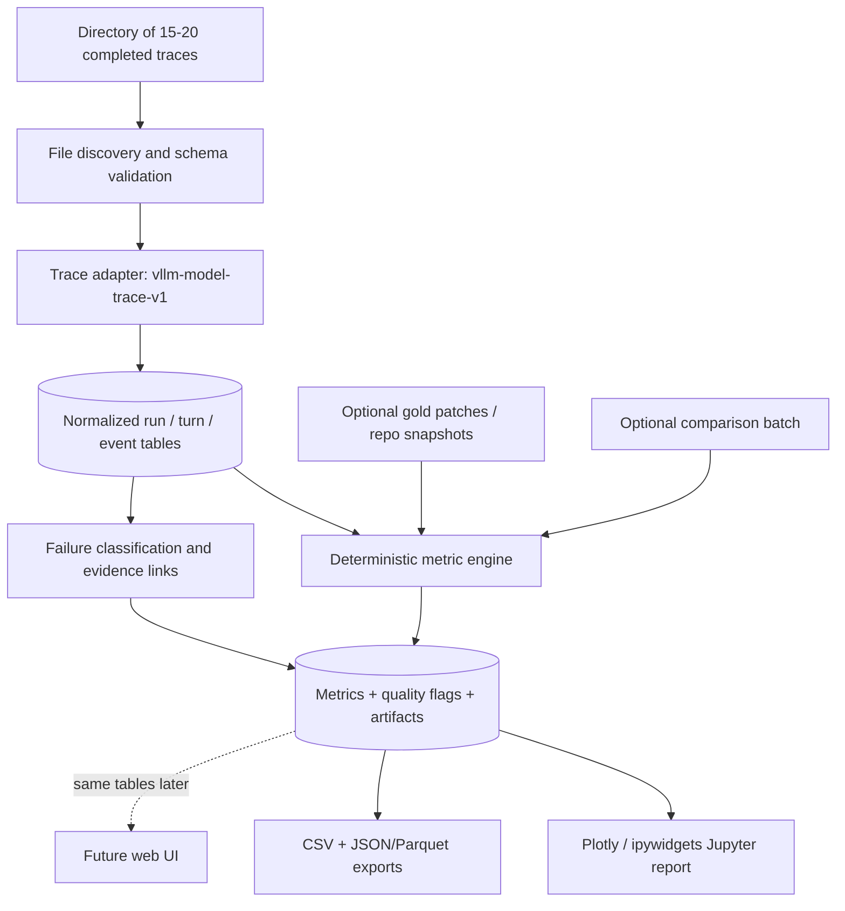

# Gemma 4 Developer Agent — Post-Run Trace Analytics Specification

**Version:** 1.0 (proposed)  
**Target:** Jupyter Notebook first; reusable Python analytics engine; future web UI  
**Audience:** Agent research / evaluation engineering  
**Primary input:** A directory containing approximately 15–20 completed `model_trace.json` files  
**Operating model:** Offline, read-only, post-hoc analysis; no execution of agents, patches, or tests

## 1. Purpose and decisions

Build an interactive Jupyter report that explains *why* coding-agent tasks are solved or unsolved by examining traces from a completed batch. It must calculate robust run-level metrics, visualize sequences of tool use, pinpoint failure stages, compare outcomes across the batch, and generate evidence-linked intervention suggestions. The analysis core must be UI-independent so a dashboard can consume exactly the same normalized tables later.

**Optimize for:** (a) actionable, reliable diagnosis, (b) low-overhead analysis of 15–20 tasks, (c) clear missing-data disclosure, (d) visualization rather than walls of text. **Do not invent a composite agent score.** Official resolution remains the primary outcome; other metrics explain it.

**Scope assumptions**
- All tasks have already finished. The notebook performs no agent runs, test execution, git checkout, package installation, or remote API requests.
- Each file may contain verbose replicated prompts and raw JSON in addition to parsed fields. Parse the structured fields first.
- Gold patches, pristine repository snapshots, code graphs, and comparison batches are **optional** side inputs, not prerequisites for useful V1 analysis.
- Single-batch analysis is a descriptive diagnosis, not a causal comparison; paired experiments require a second batch mapped by `task_id` and configuration.
- A trace may have incomplete or contradictory fields. Preserve the raw evidence and show `unknown` or `not_available` when a metric cannot be calculated.

## 2. Verified trace facts and why they matter

Inspection of the attached sample `/mnt/data/model_trace.json` established:

| Observed field/event | Sample value | Consequence |
|---|---|---|
| `schema_version` | `vllm-model-trace-v1` | Define an adapter for this schema, versionable for future formats. |
| `run.task_id` | `fastapi_5624` | Primary task identifier; check agreement with final result. |
| `turns` | 30 records | Turns are not the same as billable calls. |
| `final.result.total_llm_calls` | 29 | One turn is a compaction/summarizer event; don't equate turns and regular agent calls. |
| Tool attempts recorded | 28 | Each attempted tool call gets an event row. |
| Tool result records | 27; turn 10 call has no matching result | Keep unmatched tool calls with `result_linked=false` and outcome unknown. |
| `final.result.tool_calls` | 25 | Official budget-counted calls differ from attempts. |
| `final.result.status` | `SUCCESS` | Harness completion, not task correctness. |
| `final.result.resolved` | `false` | Task correctness / evaluation outcome. |
| `final.result.test_exit_code` | 1 | Independent verification failed. |
| `final.result.agent_patch` | Non-empty unified diff | Patch existence must be separate from resolution. |
| `final.result.duration_seconds` | ~139.11 | Prefer this over model `created` timestamp span for total duration. |
| Error tool results | `FileWriteError`, `CommandError`, `BudgetExceeded` | Record distinct failure classes, not simply ‘bad tool calls’. |
| Prompt budgets | System message says 40 calls; task message says 25 | Detect conflicting budget instructions; actual budget from harness result/status. |
| `final.result.total_tokens` | 0, while per-turn `usage` values exist | Use per-turn tokens; report conflicting/missing aggregate values. |
| Turn 11 | Summarizer-style response with 1 prompt message and no tool call | Compaction/summarizer events must be identifiable and separate from task work. |

One `run_command` call (turn 10) has no corresponding `tool_results` entry, which should be visible as missing evidence, not classified as an execution failure. The sample agent edited `fastapi/dependencies/utils.py`, then a second intended edit was rejected after the budget was exhausted. The final verification failed on `test_security_scopes_dont_propagate`, showing unintended security-scope propagation. A reproduction-writing attempt failed because a tool could not write outside `/workspace`; a different shell-based repro attempt then failed due to incorrect code. These observations should be discoverable directly from the notebook without reading the entire 3.18 MB raw JSON.

## 3. User workflow and input contract

**Notebook launch:** The user supplies a `TRACE_DIR` and optionally `GOLD_DIR`, `REPO_ROOTS`, and `COMPARE_DIR`. The notebook runs once after agent execution is finished and renders outputs inline.

**Supported patterns**

```text
experiment_root/
  run_A/
    fastapi_5624/model_trace.json
    rich_1000/model_trace.json
    requests_456/model_trace.json
    ...
  optional_gold/
    fastapi_5624.patch
    rich_1000.patch
```

A flat directory with one JSON file per task is also allowed. Discover recursively using configurable filename patterns (default `model_trace.json`, `trace_*.json`); explicitly exclude generated `reports/` and cache folders. Default behavior must not scan unrelated directories.

**Notebook configuration example**

```python
CONFIG = {
    "trace_dir": "/path/to/completed_tasks",
    "trace_globs": ["**/model_trace.json", "**/trace_*.json"],
    "gold_dir": None,       # optional; patch files keyed by task_id
    "repo_roots": {},       # optional; repository name -> checkout path
    "compare_dir": None,    # optional second experiment batch
    "output_dir": "./reports/gemma4_run_001",
    "experiment_id": "baseline_v1",
    "strict_schema": False,
    "redact_text": True,
    "include_reasoning_in_viewer": False,
}
```

**Ingestion requirements**
1. Discover candidate files, report discovered/accepted/rejected counts.
2. Parse each as JSON and validate the supported shape; reject invalid JSON with a per-file explanation, never crash the whole batch.
3. Extract task ID from `run.task_id` with `final.result.task_id` as a validation check. If inconsistent, raise a data-integrity warning.
4. Identify each run as `(experiment_id, task_id, trace_sha256)`; never silently overwrite duplicates. If two traces for one task exist, treat as separate attempts with `attempt_id` and mark ambiguous pairing.
5. Preserve original source filename, schema version, file hash, and parser warnings for auditability.
6. Treat unknown or absent fields as optional; provide null-plus-reason rather than guessed values.
7. Never execute `run_command` strings, `arguments` content, patch text, or any code embedded in a trace.

**Minimum for a valid task:** `run.task_id` (or a recoverable final task ID) and a list of `turns`. A trace without `final.result.resolved` is analyzable but the outcome is **unknown**, not false.

## 4. Architecture



**Keep notebook thin:** notebook cells orchestrate and render; import reusable functions from a plain Python package. No chart should parse raw JSON directly. No core metric computation should depend on Jupyter widgets.

**Proposed project layout**

```text
gemma4_eval/
  notebooks/01_agent_trace_report.ipynb
  src/agent_eval/
    ingest.py
    adapters/vllm_trace_v1.py
    models.py
    events.py
    metrics/{outcomes,tools,edits,tests,budget,localization}.py
    failures.py
    evidence.py
    plots/{overview,timeline,tools,budgets,tests,gold}.py
    exports.py
  tests/{test_adapter,test_metrics,test_failures,test_e2e}.py
  fixtures/sample_model_trace.json
  README.md
  pyproject.toml
```

## 5. Canonical data model

Normalize into the following linked records. Use Pandas DataFrames in V1; Parquet is optional; CSV and JSONL must always be available.

| Table | Key | Critical columns |
|---|---|---|
| `runs` | `run_id` | `task_id`, `experiment_id`, `repo`, `resolved_nullable`, `harness_status`, `test_exit_code`, `duration_seconds`, `budgeted_tool_calls`, `reported_llm_calls`, `trace_path`, `trace_hash`, `schema_version` |
| `turns` | `(run_id, turn_number)` | `created_epoch`, `finish_reason`, `prompt_tokens`, `completion_tokens`, `reasoning_tokens`, `is_compaction`, `assistant_text_available` |
| `tool_calls` | `(run_id, call_id)` | `turn_number`, `sequence_index`, `name`, `arguments_json_valid`, `schema_valid`, `arguments_summary`, `requested_path`, `command_category`, `result_linked` |
| `tool_results` | `(run_id, call_id)` | `status`, `error_type`, `error_message_excerpt`, `exit_code`, `budget_warning`, `patch_size`, `files_changed`, `output_truncated` |
| `events` | `event_id` | `run_id`, `turn_number`, `event_order`, `kind`, `tool_name`, `target`, `status`, `evidence_id`, `time_source` |
| `patches` | `run_id` | `has_patch`, `patch_bytes`, `modified_files`, `added_lines`, `deleted_lines`, `diff_parse_ok` |
| `test_evidence` | `evidence_id` | `run_id`, `source` (agent-side/external), `turn_number`, `test_command`, `exit_code`, `parsed_passed`, `parsed_failed`, `parse_confidence`, `post_last_edit` |
| `metrics` | `(run_id, metric_id)` | `value`, `unit`, `availability`, `unavailable_reason`, `method_version`, `evidence_ids` |
| `findings` | `finding_id` | `run_id`, `category`, `severity`, `confidence`, `headline`, `evidence_ids`, `suggested_intervention` |
| `quality_issues` | `issue_id` | `run_id`, `field_path`, `issue_type`, `description` |

**Evidence linking:** Every calculated metric and actionable finding must link back to one or more original `(trace_path, turn_number, tool_call_id / result)` locations. Provide clickable notebook expanders for these references. Store excerpts, not full duplicated prompts, in DataFrames.

**Time and token handling**
- Distinguish `turn_count`, `regular_agent_llm_calls`, `tool_attempts`, and `budgeted_tool_calls`.
- Prefer `final.result.duration_seconds` for elapsed run duration. Use model `created` timestamps only for approximate event ordering and inter-response intervals; do not infer precise tool duration from those alone.
- Sum per-turn `usage.prompt_tokens`, `usage.completion_tokens` and reasoning-token details as *reported inference usage*. Note that prompt tokens count recurrent context in each request; do not treat this as unique context length. Expose compaction turns separately.
- If aggregate totals conflict with per-turn data, surface both with a quality warning, rather than coercing one.
- A tool-result `status='ok'` describes tool execution, not whether a test succeeded. For test commands, inspect `exit_code` and test output.

## 6. V1 metrics — computation and availability

Use the 12 agreed core metrics, but explicitly qualify which are obtainable **from traces alone**.

| ID | Metric | V1 algorithm | Trace-only? | Availability rule |
|---|---|---|---|---|
| C01 | Resolved rate | count `final.result.resolved == true` / count known outcomes | Yes | Unknown outcomes excluded from denominator; show coverage |
| C02 | Test transition results | Parse final `test_output` and `test_exit_code`; FAIL_TO_PASS/PASS_TO_PASS only with known test identities and baseline status | Partial | Without baseline, show final pass/fail and parsed test counts, not transitions |
| C03 | Usable patch rate | Nonempty `agent_patch`; parse unified diff; distinguish existence from apply success | Partial | Clean application requires repo + applying patch (not in read-only V1), so display `not_verified` |
| C04 | Gold-function discovery recall | Gold functions actually viewed / gold functions | **No** | Need gold patch, function map and sufficient returned read/search content |
| C05 | Gold-function edit recall | Gold functions modified in final patch / gold functions | **No** | Need gold patch and reliable function-to-file line mapping |
| C06 | Tool-call validity | Parse each `arguments_raw_json`, validate name and parameters from `input.vllm_request.tools` | Yes | Schema warnings; separate unknown keys, missing required, type mismatch, parse error |
| C07 | Edit execution success | `edit_file`/`write_file` results `status='ok'` / attempted edit calls | Yes | Also show failures by reason; note `run_command` mutations separately as inferred |
| C08 | Final-edit verification | Find most recent confirmed successful source edit; look for a subsequent agent-side test/repro command | Partial | Distinguish confirmed tests from heuristic command matches; external final tests do not count |
| C09 | Budget exhaustion stage | Detect `BudgetExceeded`, `get_status` budget, warnings, lack of remaining calls; assign pre-edit/post-edit/pre-verification | Yes | Prefer final/status budget counts over raw attempts |
| C10 | Execution cost | `duration_seconds`, calls and per-turn usage; run-level distributions | Yes | Missing duration => unavailable; do not substitute model timestamp difference silently |
| C11 | Primary failure stage | Rule-based evidence-driven labels; manual review for ambiguous cases | Partial | Avoid forcing root-cause labels when evidence insufficient |
| C12 | Paired outcome change | Match same task IDs across `experiment_id`/`compare_dir`; solved↔failed transitions | **No**, for one batch | Enable only with second comparable batch |

**Supplementary always-on metrics:** per-tool attempt/success/error counts, first source edit call, test-after-edit indicator, patch-size/file count, compaction detection, budget-instruction conflict, token usage, duplicate reads/searches, final-response success-claim mismatch (flag only). These enrich charts without becoming separate scored objectives.

**Advanced modules** (optional): `gold_localization`, `patch_scope`, `graph_retrieval`, `edit_survival`, `test_recovery`, `reasoning_judge`, `reliability`, `cross_config`. All must expose their own prerequisites and never turn `unavailable` into zero.

### Specific classification rules

1. **Tool schema validity:** compare parsed arguments against the contemporaneous declared function schema. Record absent/unknown keys. If a call has unparseable raw arguments but a parsed `arguments` object exists, retain both versions and flag discrepancy.
2. **Tool execution failure:** `status='error'` is a tool-level failure, but `CommandError` may indicate a deliberately failing repro or test; categorize separately from malformed calls.
3. **Successful edit:** `edit_file`/`write_file` returns `status='ok'`. `run_command` can mutate files; infer only when a recorded diff/status or a reliable command heuristic supports it. Don't equate absence of an edit tool with absence of code modification.
4. **Agent-side test:** regex/command parser for targeted pytest, unittest, `python /tmp/repro.py` and explicit assertions. Shell pipes like `pytest | tail` may hide upstream exit status unless `pipefail` is present, so parse output and mark confidence. `final.result.test_output` is *external verifier evidence*, never an agent-side test.
5. **Post-last-edit verification:** agent-side test event must appear strictly after last confirmed edit. If later changes made by shell cannot be ruled out, flag `possible_untracked_edit`.
6. **Primary failure stage:** prefer directly observable blockers. Labels: `environment_or_harness`, `no_patch`, `localization`, `reasoning_or_incomplete_fix`, `tool_format`, `edit_execution`, `verification`, `budget`, `unknown`. Multiple secondary labels allowed. `reasoning_or_incomplete_fix` should not be assigned solely because a task is unresolved; require positive evidence or manual adjudication.
7. **Compaction:** a model turn with summarization instructions/content and a subsequent context reset is a `compaction` event; preserve the original observation as a heuristic where explicit tags are absent.
8. **Budget contradiction:** compare numerical budget statements extracted from system/task messages with recorded harness limits, but treat the harness fields as authoritative. Avoid parsing numbers in unrelated narrative as budget claims.

## 7. Notebook design — visual-first report

Each section has a question, an interactive graphic, and an evidence drill-down. All sections should support optional task/repository filters, and missing evidence should produce an explanatory empty state rather than a broken chart.

| Section | Primary questions | Visualizations | Click/filter interaction |
|---|---|---|---|
| 0. Load & data quality | Did all files parse? What is missing? | Intake progress, file coverage table, schema-warning counts | Click a bad file to inspect warning |
| 1. Batch overview | How many tasks resolved? | KPI cards, outcome donut/bar, Wilson interval, results by repository | Repo/task selector |
| 2. Task matrix | Which tasks failed and why? | Heatmap: tasks × key indicators (resolved, edit, tested, budget, tool errors), sortable task grid | Select a task to drill down |
| 3. Failure distribution | At what stage does execution break? | Failure-stage stacked bar, stage funnel / Sankey **only when stage evidence exists**, evidence list | Filter by failure category |
| 4. Tool reliability | Which tools cause failures? | Tool attempt/result stacked bar, error-type Pareto, schema-error table | Click tool to show calls/results |
| 5. Budget & efficiency | How is budget spent? | Per-task calls vs duration scatter (color by outcome), budget exhaustion bar, call usage progress | Hover task; jump to timeline |
| 6. Investigation/editing | When did the agent inspect/edit code? | Per-task event timeline (search, read, edit, test, submit, budget), file-activity waterfall | Hover event to view source |
| 7. Verification | Was the final patch tested? | Per-task post-edit-test binary matrix, test result distribution, verification gap timeline | Show last edit and nearest test evidence |
| 8. Token/context | Were context and inference budgets stressed? | Token-by-turn line/area, compaction vertical markers, finish-reason breakdown | Select turns and inspect context-reset clues |
| 9. Gold analysis (optional) | Did it discover/edit reference functions? | File/function overlap bars, discovery latency, gold-versus-agent file matrix | Display matched/unmatched symbols |
| 10. Single-task explorer | What exactly happened on this run? | Zoomable tool-call timeline, error sequence, side-by-side patch/test excerpts, drill-down table | Expand full tool arguments/results with redaction |
| 11. Findings & next actions | What should the engineer change? | Ranked evidence-backed findings by frequency × actionability, no composite score | Expand evidence and proposed intervention |
| 12. Paired experiments (optional) | Which tasks improved or regressed? | Solved↔failed transition matrix, per-task delta table, paired runtime chart | Compare same task across two configurations |

**Visual design conventions**
- Use consistent tool-event colors/shapes, error markers, and explicit legends; accessible palette and readable annotations.
- Keep `resolved`, `harness_status`, and `test_exit_code` separate; never color harness `SUCCESS` as issue resolution.
- Show numerator, denominator and coverage alongside percentages. With 15–20 tasks, display raw task counts and confidence intervals; avoid unsupported statistical certainty.
- Avoid large pie charts and dozens of static figures. Use coordinated interactive selectors (ipywidgets) and lazy drill-down displays.
- Treat evidence as tooltips/expanders, not thousands of lines dumped into notebook cells. Truncate safely and provide source-event pointers.
- Every chart should state whether it is trace-derived, gold-derived, heuristic, or based on judge/manual review.

## 8. Task drill-down interaction contract

1. Choose `task_id` from a dropdown, or click a task on a cross-task chart.
2. Display task summary: `resolved`, final test result, patch files, duration, tool-attempt count, budgeted count, confirmed edits, post-edit agent tests, primary failure label and confidence.
3. Show ordered visual timeline with categories: search/read, graph retrieval, write/edit, command/test, submit, budget warning, compaction, final verifier.
4. Clicking an event reveals: model turn, call ID, tool name, normalized arguments, tool status, output/error excerpt, elapsed ordering, schema warnings and the raw trace pointer.
5. Show final unified diff with syntax-aware or plain-text highlighting; never execute it.
6. Show external verification stdout/stderr in a separate pane with failing assertions emphasized, alongside agent-side test history.
7. Show automated findings with evidence links and one suggested next engineering intervention per finding.

**Sample trace should visually expose:** the late first source edit, `/tmp` write restriction, repro command exception, an accepted edit followed by a budget-rejected edit, post-edit lack of agent-side verification, successful patch capture, and failed external verification. Do not assume the failed second edit alone was the cause of the failed test without additional evidence.

## 9. Failure attribution and recommendation rules

Use rules before judges. An unresolved task can have one tentative primary stage **plus multiple factual secondary failure tags**. All findings contain a `confidence` (`high`/`medium`/`low`) and evidence IDs.

| Observed evidence | Diagnostic finding | Candidate intervention |
|---|---|---|
| Wrong/unknown tool keys or malformed JSON | Tool-call format problems | Tool-schema examples, validation, targeted training |
| `edit_file` failures / rejected file paths | Editing tool mismatch | Path-aware edit strategy, tool instructions |
| Many reads, no successful edit until close to budget | Late implementation | Targeted search + earlier edit checkpoint |
| Gold function never inspected (gold available) | Localization bottleneck | Repository/graph retrieval improvement |
| Gold function inspected but relevant final edit missing | Investigation-to-edit bottleneck | Patch planning/edit execution improvement |
| Post-last-edit agent test absent | Final verification gap | Dedicated targeted verification step |
| Test fails, followed by no corrective attempt | Feedback utilization gap | Test-failure interpretation/recovery skill |
| Budget exhausted with partial patch | Incomplete under budget | Earlier prioritization, bounded search, budget-aware stop |
| Context compaction followed by repeated exploration | Lost state hypothesis | Better compacted notes/context management |
| Harness status SUCCESS while `resolved=false` | Outcome terminology ambiguity | Dashboard/data-model correction, not agent training |

Separate **observed facts** from **hypotheses**. Never claim that a suggested prompt/skill/fine-tuning fix is established merely because a metric indicates a problem.

## 10. Notebook and library API

Keep external interfaces small and stable:

```python
from agent_eval import load_experiment, compute_metrics, classify_failures
from agent_eval.plots import render_report

experiment = load_experiment(CONFIG["trace_dir"], experiment_id=CONFIG["experiment_id"])
metrics = compute_metrics(experiment, gold_dir=CONFIG["gold_dir"], repo_roots=CONFIG["repo_roots"])
findings = classify_failures(experiment, metrics)
render_report(experiment, metrics, findings)  # Jupyter widgets and Plotly
```

Functional operations:
- `load_experiment(...) -> ExperimentData`: `runs`, `turns`, `tool_calls`, `tool_results`, `events`, `test_evidence`, `quality_issues`.
- `compute_metrics(...) -> MetricData`: long-format metric table with availability states and evidence.
- `classify_failures(...) -> FindingsData`: transparent rules and confidence.
- `render_report(...)`: create interactive notebook graphics only; no re-parsing.
- `export_report(...)`: export `runs.csv`, `events.jsonl`, `metrics.csv`, `findings.csv`, `quality_issues.csv`, `summary.json`, plus optional self-contained HTML charts.

V1 suggested dependencies: Python 3.11+, `pandas`, `plotly`, `ipywidgets`, `jsonschema`, `nbformat` (notebook packaging); optional `pyarrow` for Parquet, `networkx` and language parsers for gold analysis. No dashboard server, remote database, vector store or judge API needed. Dependency installation happens outside analysis execution, not from notebook cells on every run.

## 11. Acceptance criteria

### Must pass on attached sample

- Correctly detects schema `vllm-model-trace-v1` and task `fastapi_5624`.
- Records **30 turns**, **28 tool attempts**, **27 tool result records**, **25 budget-counted tool calls**, and **29 reported LLM calls** as distinct values. Flags the unmatched call on turn 10 without inventing its outcome.
- Classifies `final.result.status='SUCCESS'` as harness completion while `resolved=false`, final `test_exit_code=1`.
- Detects non-empty `agent_patch` with one modified file; does not claim patch applies cleanly without checking against a repository.
- Identifies one successful `edit_file` and one budget-rejected `edit_file`, plus `FileWriteError` and `CommandError` records.
- Distinguishes the independent final verification from agent-side tests and flags no confirmed agent-side test following the final successful source edit.
- Detects a compaction/summarization event or a high-confidence heuristic candidate (turn 11).
- Reports the observed 40-versus-25 call-budget instruction contradiction, with 25 as the harness budget.
- Finds completion tokens from per-turn usage despite `final.result.total_tokens=0` and reports the mismatch.
- Offers a graphical task timeline and failing test excerpt without reading the full raw JSON into the notebook output.

### Must pass on a mixed 15–20 trace batch

- One malformed file does not break ingestion of other valid files.
- Missing gold does not cause fake zeros for gold-function metrics.
- Duplicate task IDs remain separate attempts, not overwritten.
- Outcomes of unknown status are not silently counted as failures.
- Every displayed percentage gives denominator and coverage.
- Filtering by repo/task changes charts and task explorer consistently.
- Re-running notebook cells on the same input yields the same deterministic metrics and no duplicate output rows.
- Analysis requires no internet, agent reruns, clean repo checkout, or execution of trace contents.
- Outputs are reproducibly exported for a later dashboard.

### Tests to implement

- Unit fixtures for malformed JSON, missing `final`, multi-tool-call turns, result-less calls, raw-vs-parsed argument conflicts, empty patches, command exit-code failure, prompt budget mismatch, timestamps missing, and compaction.
- Golden fixture assertions for uploaded sample, including tool counts and classification.
- End-to-end integration test using directory of synthetic traces plus the supplied example.
- Cross-version parser test that warns gracefully when `schema_version` is unknown.

## 12. Explicit non-goals for V1

- No patch execution or local replay of tests.
- No online Kaggle submission or leaderboard tracking.
- No automatic model fine-tuning, prompt rewriting, or autonomous edits.
- No unconditional LLM judge for semantic correctness, reasoning quality or root cause.
- No guaranteed function-level gold localization without reference patch + repository/symbol mapping.
- No causal claims or meaningful pass@k estimates from a single attempt per task.
- No heavyweight web service, live telemetry collector, or production database.
- No single weighted aggregate ‘agent quality’ score.

## 13. Delivery stages

**Milestone 1: Trace adapter + batch tables.** Validate 15–20 files, normalize data, test against the sample, and generate ingestion/quality report.

**Milestone 2: Visual notebook.** Deliver overview, task matrix, tool breakdown, event timeline, budget analysis, verification panel, and task drill-down; exports and evidence links.

**Milestone 3: Optional enrichments.** Gold-patch localization when gold/repository paths are available, graph retrieval analysis if graph results can be parsed, cross-configuration comparison when another batch is supplied, and calibrated semantic judge only if necessary.

**Ready for future UI:** `src/agent_eval` returns structured tables and findings; Jupyter visualizations are replaceable presentation adapters. A Streamlit/Dash/React implementation can consume the same outputs without rebuilding trace normalization or metric computation.

## 14. Open items (non-blocking)

- The actual parent-directory organization of the 15–20 completed traces.
- Whether separate gold patches, pristine repositories, and graph assets will be co-located, and naming conventions.
- Whether there will be one configuration/batch or multiple comparison batches.
- Whether intermediate file-state snapshots exist beyond `edit_file` diffs and final `agent_patch`.

All four are optional V1 inputs. The implementation should proceed with trace-only graphics and progressively unlock richer views when these inputs become available.
